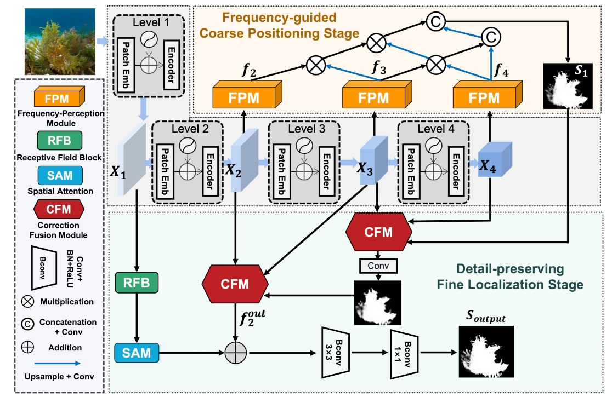

# Frequency Perception Network for Camouflaged Object Detection

> **Authors:** [Runmin Cong](https://openreview.net/profile?id=\~Runmin_Cong1), [Mengyao Sun](https://openreview.net/profile?id=\~Mengyao_Sun1), [Sanyi Zhang](https://openreview.net/profile?id=\~Sanyi_Zhang1), [Xiaofei Zhou](https://openreview.net/profile?id=\~Xiaofei_Zhou2), [Wei Zhang](https://openreview.net/profile?id=\~Wei_Zhang7), and [Yao Zhao](https://openreview.net/profile?id=\~Yao_Zhao1).

## 1. Preface

*   This repository provides code for "***Frequency Perception Network for Camouflaged Object Detection***" ACM MM 2023. [Paper](https://openreview.net/pdf?id=ug66Ewg8bi)

## 2. Overview

### 2.1. Introduction

Camouflaged object detection (COD) aims to accurately detect objects hidden in the surrounding environment. However, the existing COD methods mainly locate camouflaged objects in the RGB domain, their performance has not been fully exploited in many challenging scenarios. Considering that the features of the camouflaged object and the background are more discriminative in the frequency domain, we propose a novel learnable and separable frequency perception mechanism driven by the semantic hierarchy in the frequency domain. Our entire network adopts a two-stage model, including a frequency-guided coarse localization stage and a detail-preserving fine localization stage. With the multi-level features extracted by the backbone, we design a flexible frequency perception module based on octave convolution for coarse positioning. Then, we design the correction fusion module to step-by-step integrate the high-level features through the prior-guided correction and cross-layer feature channel association, and finally combine them with the shallow features to achieve the detailed correction of the camouflaged objects. Compared with the currently existing models, our proposed method achieves competitive performance in three popular benchmark datasets both qualitatively and quantitatively.

### 2.2. Framework Overview

      

***Figure1:*** The overview of our proposed two-stage network FPNet. The input image is first extracted with multi-level features by a PVT encoder. In the frequency-guided coarse localization stage, we use FPM for frequency-domain feature extraction and generate the coarse COD map `$S_1$`. Then, in the detail-preserving fine localization stage, the CFM is used to chieve progressively prior-guided correction and fusion across high-level layers. Finally, the first-level high-resolution features are further introduced to refine the boundaries of camouflaged objects and generate the final result `$S_{output}$`.

## 3. Proposed Method

### 3.1. Training/Testing

The training and testing experiments are conducted using [MindSpore](https://www.mindspore.cn/) with one NVIDIA 3080Ti GPU of 12 GB Memory.

1.  Configuring your environment (Prerequisites):

    *   Installing necessary packages:&#x20;

        python 3.8;

        mindspore-gpu 2.0.0;

        mindcv 0.2.2

        GPU cuda 11.1
2.  Downloading necessary data:

    *   downloading dataset and move it into `./data/`, which can be found from [Baidu Drive](https://pan.baidu.com/s/15ro0EjyKKqPLRFVs8g865w?pwd=sm2e).

3.  Training Configuration:

    *   After you download training dataset, just run `MyTrain_Val.py` to train our model.

4.  Testing Configuration:

    *   After you download all the pre-trained model and testing dataset, just run `MyTesting.py` to generate the final prediction maps.

### 3.2 Evaluating your trained model:

One evaluation is written in Python code  please follow this the instructions in `./evaluator.py` and just run it to generate the evaluation results in. We implement four metrics: MAE (Mean Absolute Error), weighted F-measure, mean E-measure, S-Measure.

**[⬆ back to top](#1-preface)**
